# Not so Epic

[1]: #Not-so-Epic
This is a modern darkish Emulation Station theme with virbrant art based on the [original theme by Chicuelo and c64-dev](https://github.com/c64-dev/es-theme-epicnoir). Not so Epic also uses [artwork by HerbFargus](https://github.com/HerbFargus/es-theme-tronkyfran)

---

## Features

- Dark and clean interface
- New high quality wallpapers for all systems
- Collections for 'All Games', 'Favorites', 'Last Played' and some 'Custom Collections' are supported
- Support for screenshots/boxart and/or video.

---

## Installation and Updating

1. Close EmulationStation

2. Goto the folder `~/.emulationstation/themes`. If it does not exist got ahead and make it.

3. Clone the theme from GitHub

    ``` bash
    cd ~/.emulationstation/themes
    git clone https://github.com/hoover900/Not-so-Epic.git --branch master
    ```

### Update

- If you installed with above instructions, open a terminal and run:

    ``` bash
    cd ~/.emulationstation/themes/Not-so-Epic
    git pull
    ```

---

## Screenshots

### Console Menus

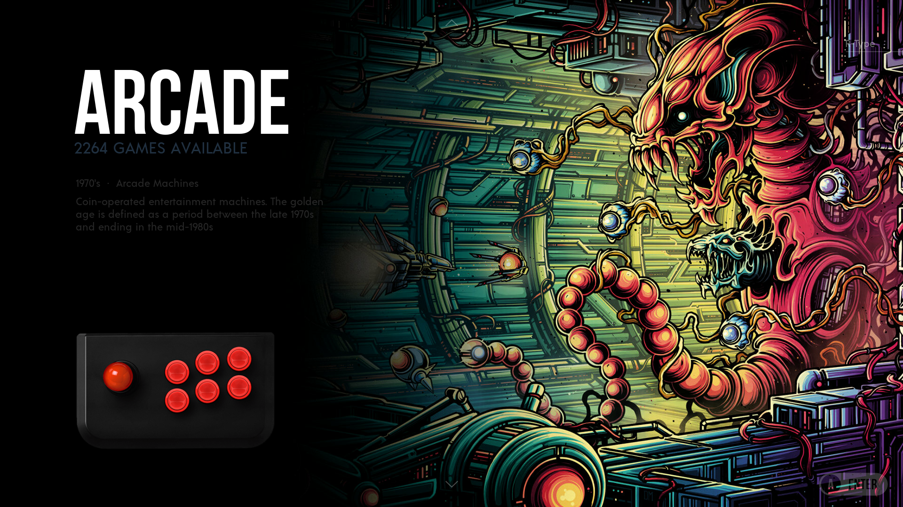 \
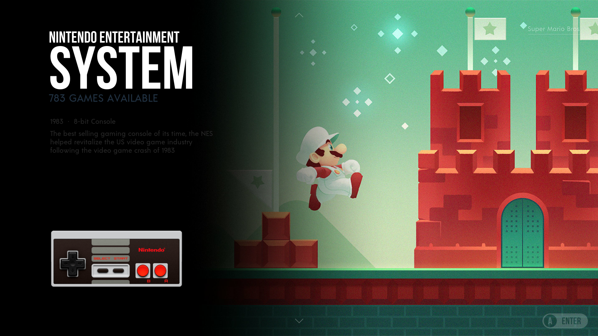 \
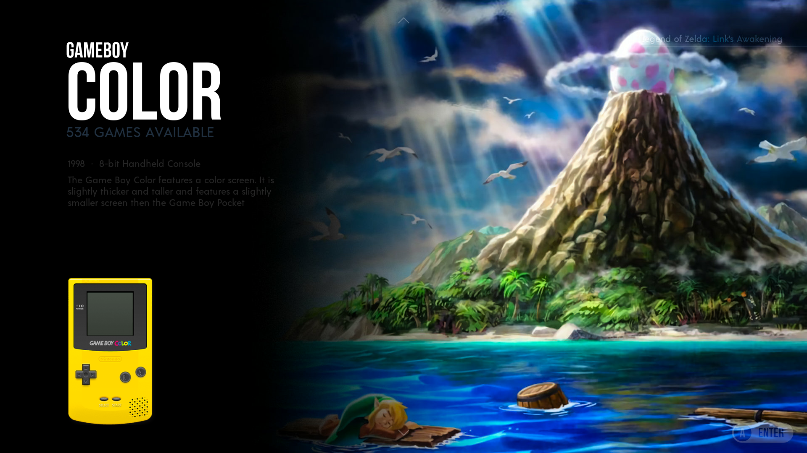 \
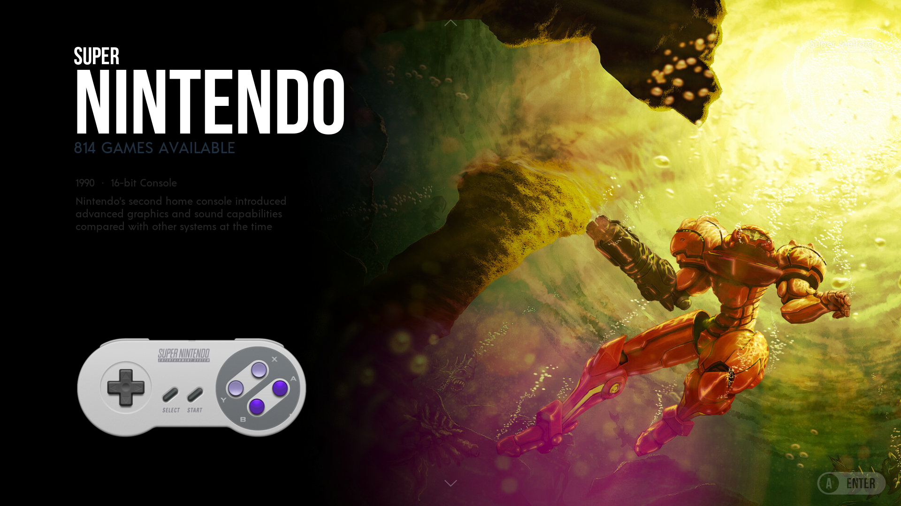 \
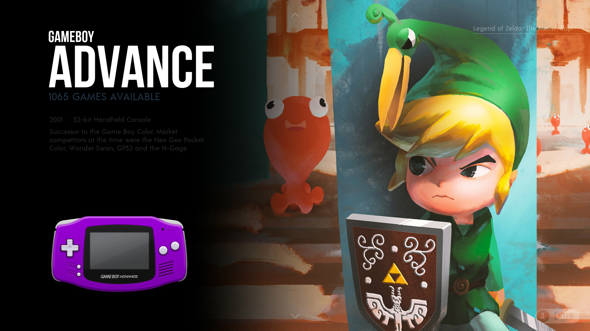 \
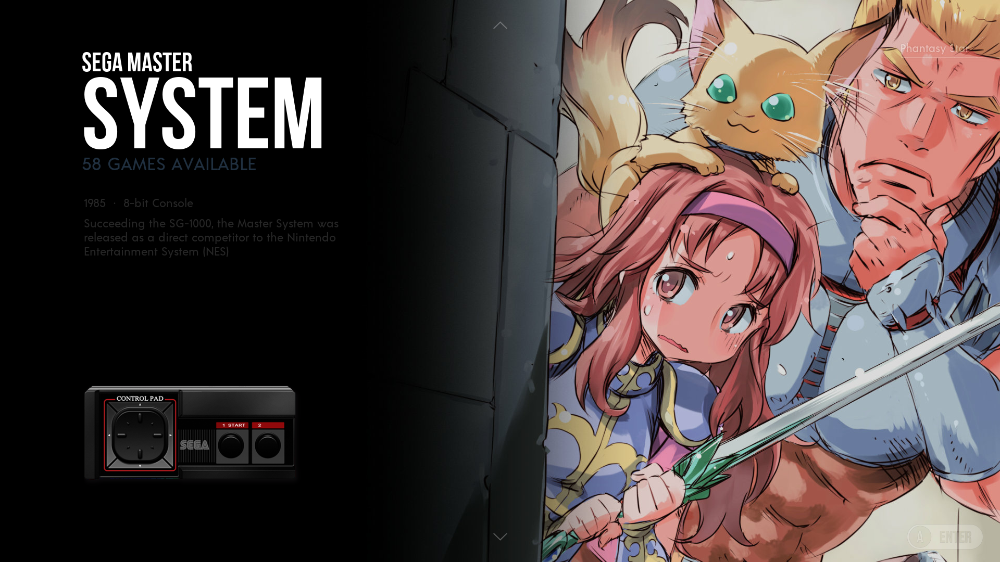 \
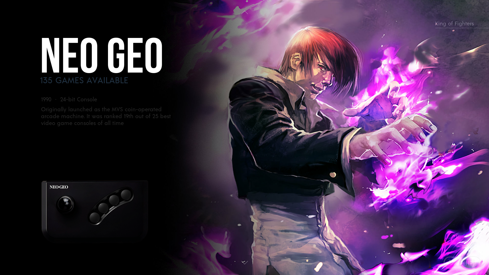 \
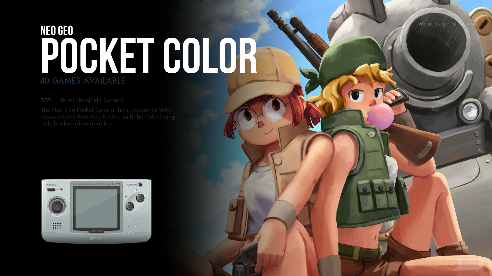 \
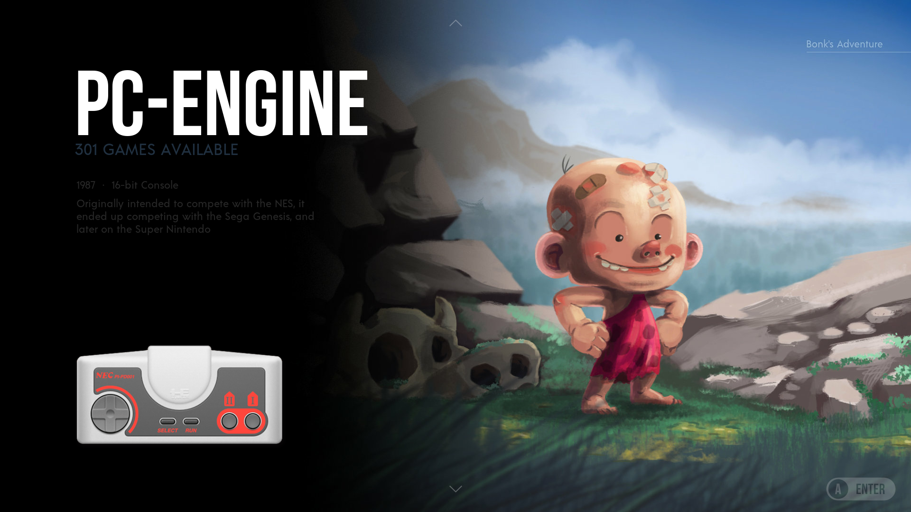 \
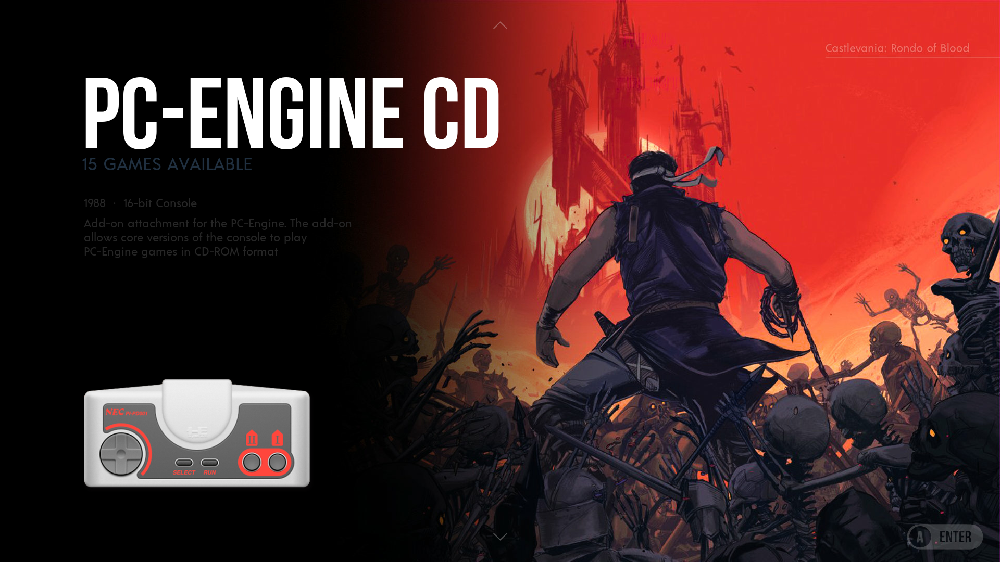 \
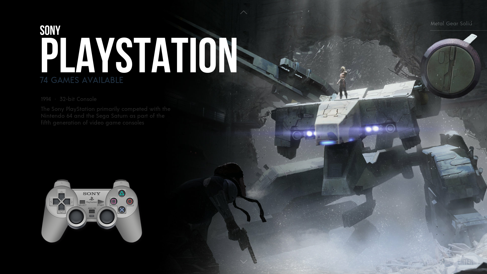 \
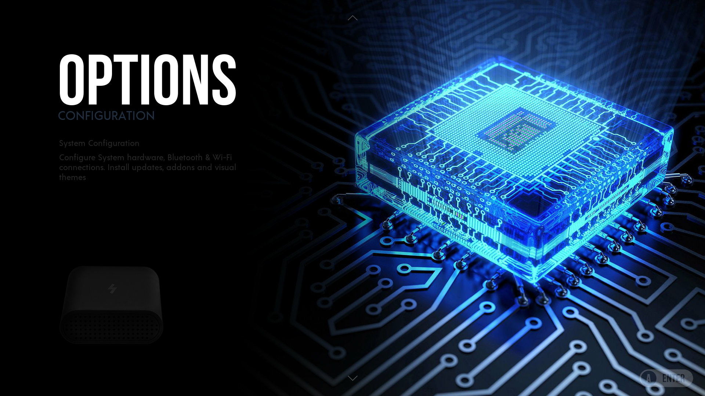 \
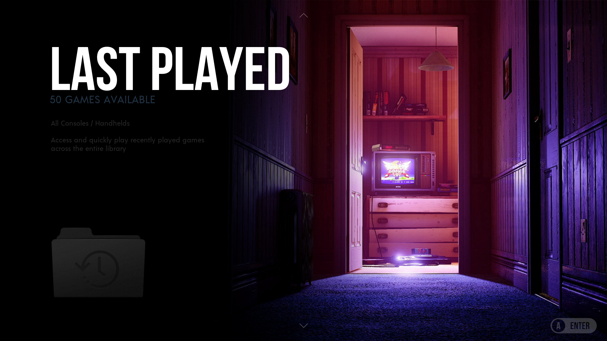

### Game List Menus

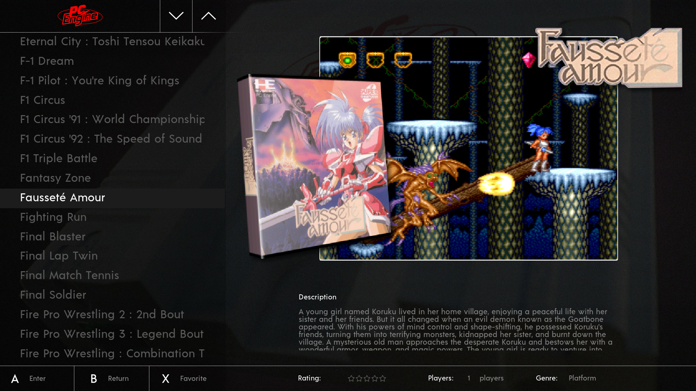 \
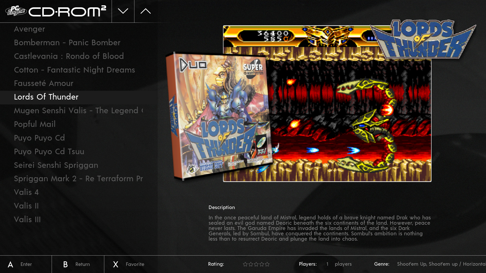 \
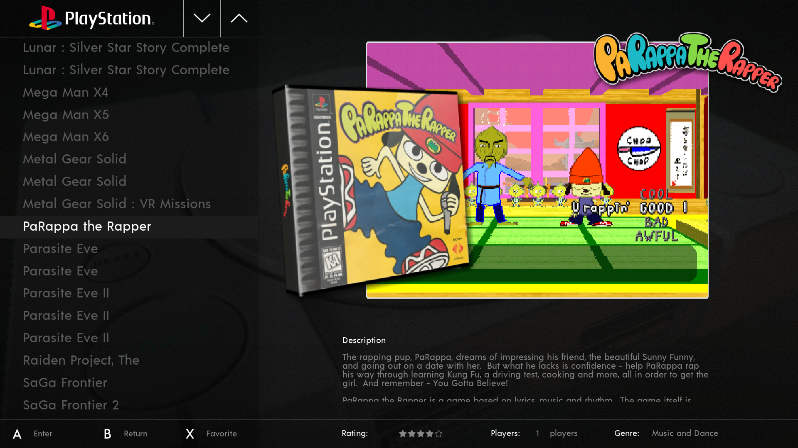 \
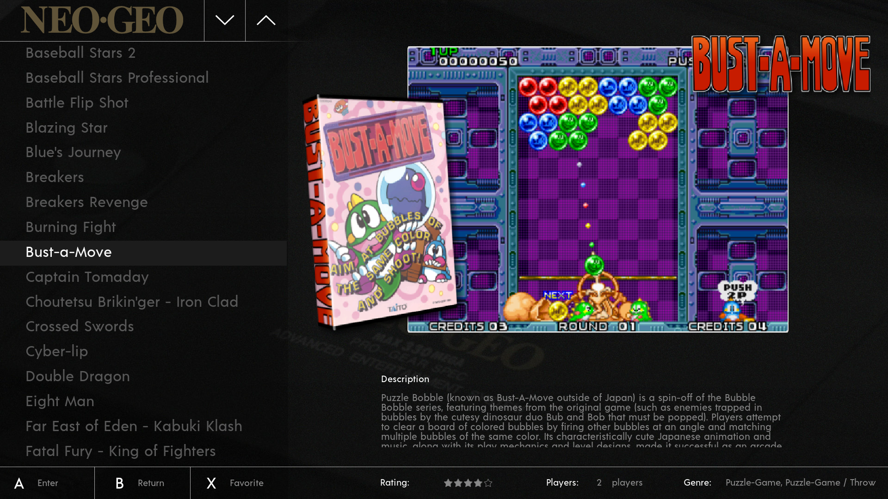

[back to top][1]

---

## Fully Supported Systems

3DO \
Atari Jaguar \
Atari Lynx \
Commodore Amiga \
Famicom & Super Famicom \
MAME \
MSX & MSX 2 \
Neo Geo \
Neo Geo Pocket & Pocket Color \
Nintendo 64 \
Nintendo DS \
Nintendo Dreamcast \
Nintendo Entertainment System \
Nintendo Gameboy \
Nintendo Gameboy  Advance\
Nintendo Gameboy Color \
Nintendo GameCube \
Nintendo SNES \
Nintendo Wii & WiiU \
PC-Engine \
ScummVM \
Sega Gamegear \
Sega Genesis \
Sega Mastersystem \
Sega Mega 32x & CD \
Sega Megadrive \
Sega Saturn \
Sega SG-1000 \
Sony Playstation \
Sony Playstation 2 \
Sony PSP \
SuperGrafx \
TurboGrafx-16 \
Wonderswan \
Wonderswan Color

**Collections:** \
Auto Collections

---

## Theme Notes

This theme supports video. You can also use a scraped image in conjunction with the video. If you scrape both, when a game is selected, it will show the screenshot for a couple of seconds before fading and playing the video.

Game screenshots are not included within the theme. You can scrape your own - you should use game boxart/screenshots and/or videos.

[back to top][1]

---

## License

This work is licensed under the [Creative Commons Attribution-NonCommercial-ShareAlike 4.0 International License](http://creativecommons.org/licenses/by-nc-sa/4.0/).
\
\


### ALLOWED

- Share and duplicate as it is
- Edit, alter, change it

### REQUIREMENTS

- Attribution, give credit to the creators
- Indicate changes to the theme
- Publish the changes under the same license

### PROHIBITED

- Commercial distribution

### Please note

By downloading and installing this theme it will be assumed that you own and possess the rights for all ROMs you intend to use. This is a free theme so you can install it and share it with others. **You are *not* allowed to sell or generate any kind of monetary profit from this theme**. Please see the [License file](./LICENSE) for more details.

---

## Thanks and Credits

All original artwork belongs to the many artists who devoted their talents and time into making them.
Most of them can be found in [DeviantArt](http://www.deviantart.com/).

[back to top][1]
